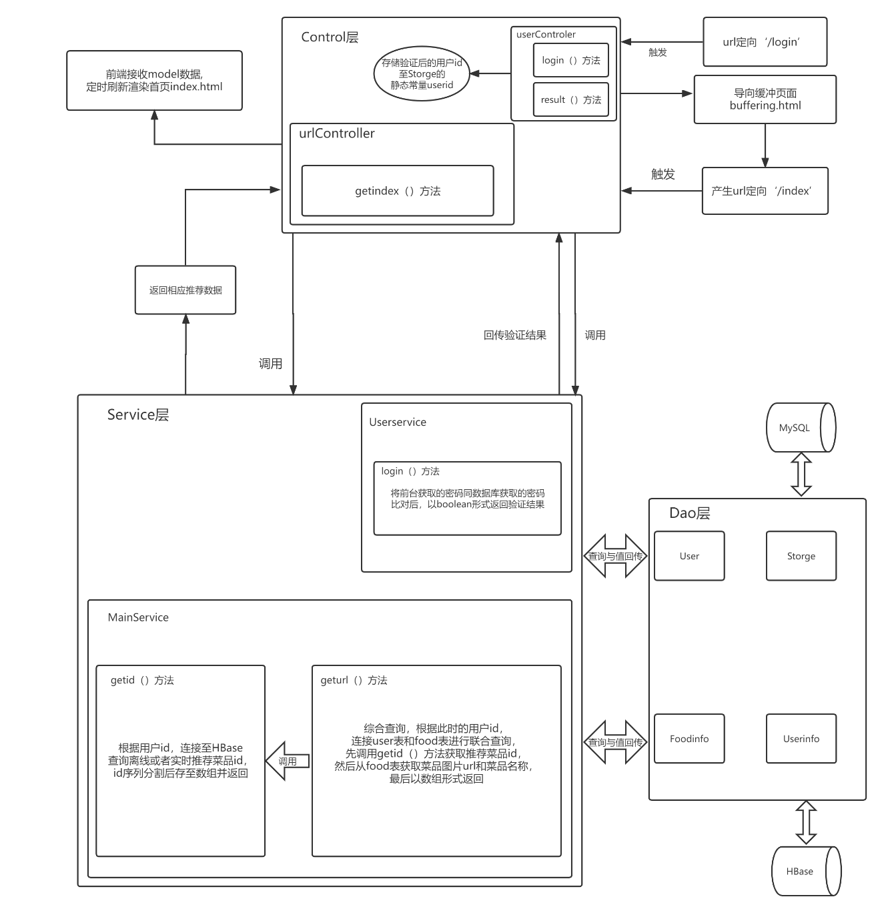
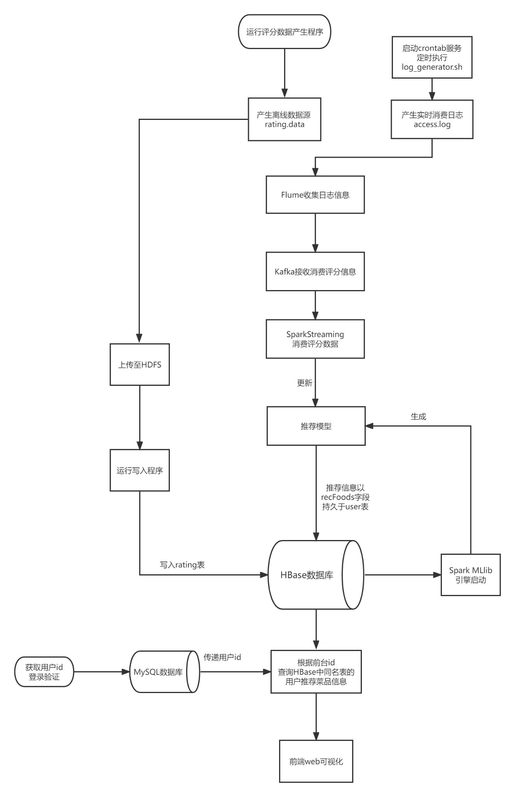

# food_recommend

#### 介绍
基于ALS协同过滤算法的大数据菜品推荐系统，
其中由Spark MLlib实现离线推荐，由Flume接收实时日志信息作为生产者，发送至Kafka消息队列，然后由Spark Streaming消费、使得推荐模型更新而实现实时推荐；最后将推荐信息持久到Hbase中，并在前端由Thymleaf实现可视化。

#### 系统结构

#### 业务逻辑实现

